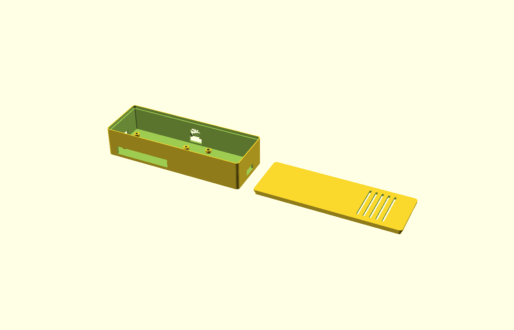

# 3D Printable Enclosure

A parametric OpenSCAD model that houses the Raspberry Pi Zero W and the 2-channel relay
module side-by-side in one printed box, sized to fit the [`SunFounder 2-Channel
Relay Module`](https://www.amazon.com/dp/B00E0NTPP4) referenced in this project's BOM.

File: [`hardware/enclosure/enclosure.scad`](../hardware/enclosure/enclosure.scad)

Pre-rendered, ready-to-slice files (verified with OpenSCAD 2026.09.23 — both parts render as
clean manifold solids, no errors): [`hardware/enclosure/stl/base.stl`](../hardware/enclosure/stl/base.stl),
[`hardware/enclosure/stl/lid.stl`](../hardware/enclosure/stl/lid.stl)

## Overview

- **Footprint:** ~144 x 51 mm
- **Height:** ~30mm base + 2.2mm lid ≈ 32mm assembled
- **Two zones, side by side:** Pi Zero W on standoffs on one end, relay module on standoffs on
  the other, with an open channel between them for jumper wires.
- **Lid:** friction-fit (no screws) — a recessed step in the base walls accepts a skirt
  molded onto the underside of the lid. No supports needed for either part.
- **Cutouts:**
  - One continuous port slot on the Pi's long front wall, spanning the mini HDMI + both
    micro-USB (data/OTG and power) connectors as a single opening — see
    [Why one slot instead of three?](#why-one-slot-instead-of-three)
  - A microSD card slot on the Pi's short end wall (opposite the wire/relay side), so you can
    swap the card without opening the case — see
    [Sizing the microSD slot](#sizing-the-microsd-slot)
  - A wire-exit slot on the relay's end wall for the four DPS/AUX dry-contact leads
    heading to the UA Hub Door Mini
  - A second wire slot on the back wall for the optional physical door-sensor cross-check lead
  - Ventilation slits in the lid over the relay's footprint (it runs faintly warm under load)
  - A thumb notch cut into the back wall so you can pop the lid off without a tool

## Print settings (FDM, PLA or PETG)

| Setting | Value |
|---|---|
| Layer height | 0.2 mm |
| Perimeters/walls | 3 |
| Infill | 15–20% |
| Supports | None required |
| Orientation | Print both parts flat, largest face down |

## Why one slot instead of three?

Raspberry Pi has never published an official mechanical drawing with exact connector positions
for the Zero/Zero W — only the board outline and mounting holes are documented (the same
official RPI-ZERO-V1_2 drawing referenced in `enclosure.scad`'s comments). An earlier revision of this model tried
to cut three separate, precisely-positioned windows for the mini HDMI and two micro-USB
connectors, using guessed coordinates — and got the wall wrong entirely (it cut them into the
short 30mm end wall, when on the real board these three connectors run along a long 65mm edge).
Rather than guess three exact positions again, the model now cuts **one generous continuous
slot** spanning the whole connector cluster on the correct long edge. It's more print-forgiving
and is the same approach most maker-community Pi Zero enclosures use for this reason.

## Sizing the microSD slot

The first version of this model had no way to reach the microSD card at all — you'd have had to
unscrew the standoffs and lift the whole board out to swap it. Since there's still no official
drawing of exactly where the Zero's microSD slot sits, its size and placement here were
cross-checked against a real, printed-and-proven reference case: [Raspberry Pi Zero Case / Zero W
Case / Zero 2 W Case, Printables model
106295](https://www.printables.com/model/106295), by ray-casting its STL to map where its
shell is actually open vs. solid (its mesh is a fully watertight, manifold solid, so the holes
don't show up as simple boundary edges — each candidate wall was scanned with a fine grid of
rays cast along the wall's normal, and any cell with no hit near the wall's surface was marked
open). That scan also confirmed the port-cluster fix above: the reference case cuts its mini
HDMI/USB openings into the long wall too, not the short one.

For the microSD slot specifically, the reference case cuts one wide, low, roughly centered
opening (about 55% of the board's width) into the short end wall — consistent with the Zero's
microSD holder sitting on the underside of the PCB near that edge. This model follows the same
approach: a single generous slot on the Pi zone's short end wall (`x = 0` face, opposite the
wire/relay side), sized and positioned by the `pi_sd_slot_*` parameters in `enclosure.scad`,
rather than a tight window sized to one exact microSD holder model/orientation.

## Recommended workflow: print → test-fit → adjust

The Raspberry Pi Zero W's board outline and mounting-hole positions are now verified against the
official Raspberry Pi Foundation mechanical drawing (RPI-ZERO-V1_2) — no need to re-check those.
What's still unverified is the relay module's exact hole spacing (varies slightly between
SunFounder hardware batches) and the exact height/reach of the port slot for your specific board
revision. Don't commit to a full production print before checking those:

1. Use the pre-rendered [`stl/base.stl`](../hardware/enclosure/stl/base.stl), or re-render it
   yourself: `openscad -o base.stl -D 'part="base"' enclosure.scad`
2. Print the base only.
3. Test-fit your actual Pi Zero W and relay module on the standoffs, and check the port cutouts
   line up well enough for your cables/connectors.
4. Adjust the parameters at the top of `enclosure.scad` (standoff hole insets, port cutout
   positions/widths, relay hole inset) to match what you measured.
5. Re-render and print the base again, then export/print the lid:
   `openscad -o lid.stl -D 'part="lid"' enclosure.scad`
6. Test the lid's friction fit. If it's too tight/loose, tweak `fit_clearance` (default 0.25mm)
   and reprint just the lid.

## Assembly

1. Screw the Pi Zero W onto its standoffs with M2.5 self-tapping screws (or M2.5 machine screws
   if you tapped the standoff holes).
2. Screw the relay module onto its standoffs with M3 self-tapping screws.
3. Wire the Pi's GPIO to the relay module's VCC/GND/IN1/IN2 per
   [`../docs/wiring-diagram.md`](../docs/wiring-diagram.md), routing the jumpers through the
   open channel between the two zones.
4. Feed the relay's four dry-contact leads (DPS +/-, AUX +/-) out through the wire-exit slot to
   the UA Hub Door Mini's terminal block.
5. Power the Pi via the micro-USB power cutout.
6. Snap the lid on.

## Customizing

All key dimensions are parameters at the top of the `.scad` file — relay board size/hole
spacing, Pi standoff positions, wall thickness, wire slot sizes, and fit tolerances. If you're
using a different relay board (e.g. a SparkFun Qwiic relay or a 4-channel board), update
`relay_len`/`relay_wid`/`relay_height`/`relay_hole_inset` accordingly rather than starting a new
model from scratch.
